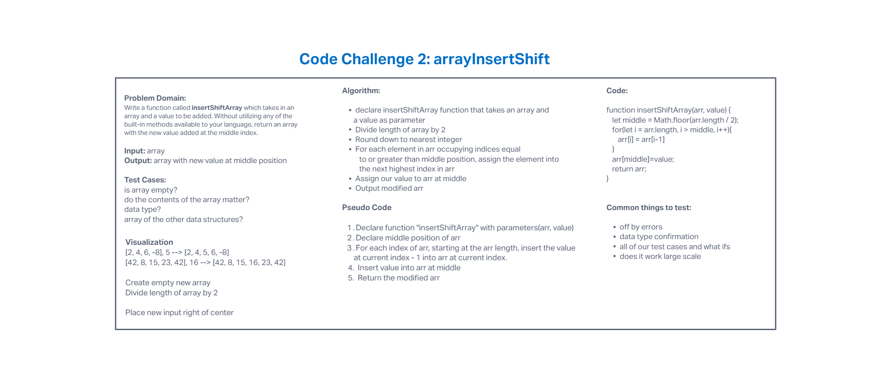

# Code Challenge 02: Array Insert Shift

## *Author: Tyler Main*

### Insert to Middle of an Array -- Whiteboard ONLY

Write a function called insertShiftArray which takes in an array and a value to be added. Without utilizing any of the built-in methods available to your language, return an array with the new value added at the middle index.

## Whiteboard

## Change Log

### Approach and Efficiency

Luis Rosales and I worked on this together. I researched how to get the middle position of the array and Luis suggested the for loop that we used.
