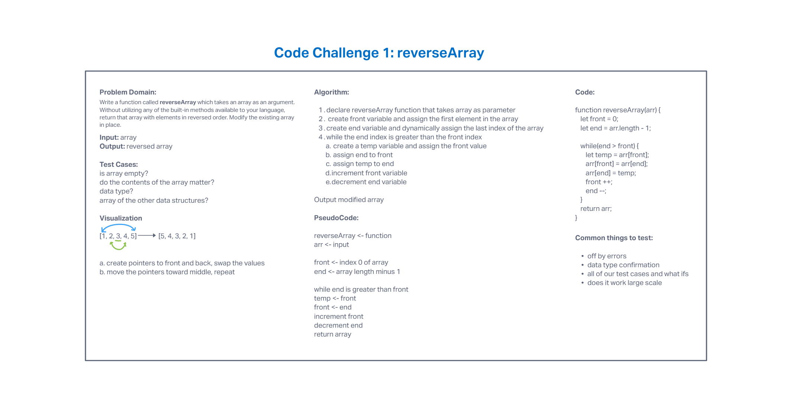

# Code Challenge 01: Reverse an Array

## *Author: Tyler Main*

## Problem Domain

### Reverse an array without built-in functions -- Whiteboard ONLY

- Write a function called reverseArray which takes an array as an argument. Without utilizing any of the built-in methods available to your language, return an array with the elements in reverse order.

## Whiteboard

## Change Log 
